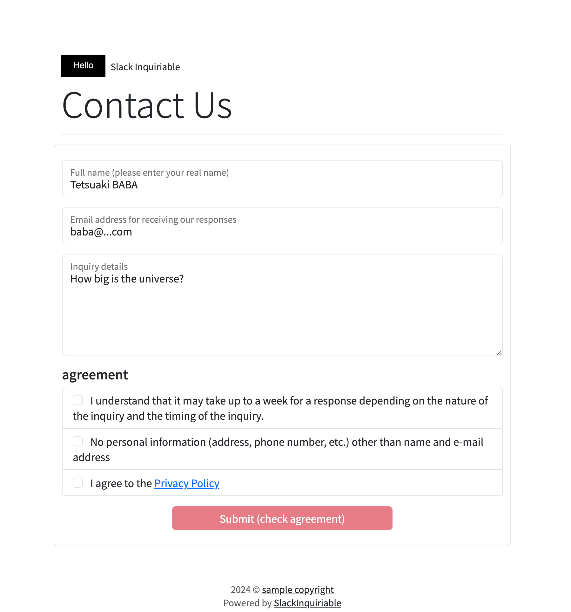

# SlackInquiriable
Slack Inquiriable enables users to Send a message to Slack from the inquiry form on the web page

<!-- teaser.pngの挿入 -->

## Getting Started
1. Clone this repository
    ```
    git clone https://github.com/TetsuakiBaba/SlackInquiriable.git
    ```
2. Get the slack webhook url
    * [how to get slack webhook url](https://www.google.com/search?q=how+to+get+slack+webhook+url&rlz=1C5CHFA_enJP1043JP1043&oq=how+to+get+slack+web&gs_lcrp=EgZjaHJvbWUqCQgAEAAYExiABDIJCAAQABgTGIAEMgYIARBFGDkyCQgCEAAYExiABDIKCAMQABgIGBMYHjIKCAQQABgIGBMYHjIICAUQABgTGB4yCAgGEAAYExge0gEINDkwNGowajeoAgCwAgA&sourceid=chrome&ie=UTF-8)

3. Generate settings.php with the following command and rewrite webuhook_url and channnel to match your environment
    ```
    echo '<?php $webhook_url = "https://hooks.slack.com/services/your_slack_webhook_url";
    $channel = "#channel_name_you_want_to_send";
    $message_to_slack = "The following inquiries were received The person in charge should reply to the e-mail address within one week."; ?>' > settings.php
    ```
4. Verify behavior in the local environment.
    ```
    php -S localhost:8000
    ```
    Then access http://localhost:8000/ from the browser and check if the message is sent to slack when you submit the form.


## Deploy 
Upload the file to a server running php. Access the uploaded file from the browser and check if the message is sent to slack when you submit the form.
  * I recommend to rewrite the included upload.txt file and execute the lftp command for easy setting up.
    * ```lftp -f upload.txt```
    * Reference: [how to install lftp](https://www.google.com/search?q=how+to+install+lftp&rlz=1C5CHFA_enJP1043JP1043&oq=how+to+install+lftp&gs_lcrp=EgZjaHJvbWUyBggAEEUYOTILCAEQABgNGBMYgAQyCwgCEAAYDRgTGIAEMgsIAxAAGA0YExiABDILCAQQABgNGBMYgAQyCwgFEAAYDRgTGIAEMgsIBhAAGA0YExiABDILCAcQABgNGBMYgAQyCwgIEAAYDRgTGIAEMgsICRAAGA0YExiABNIBCDQ5NTRqMGo3qAIAsAIA&sourceid=chrome&ie=UTF-8)

## Customization

* If you want to add agreement items to the form, Add the following code to the form in index.html
  ```
    <li class="list-group-item">
    <input class="form-check-input me-2" type="checkbox" value="">
    More agreements!!
    </li>
  ```
  

# SlackInquiriable
